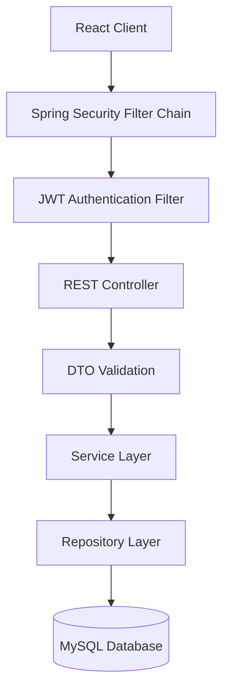
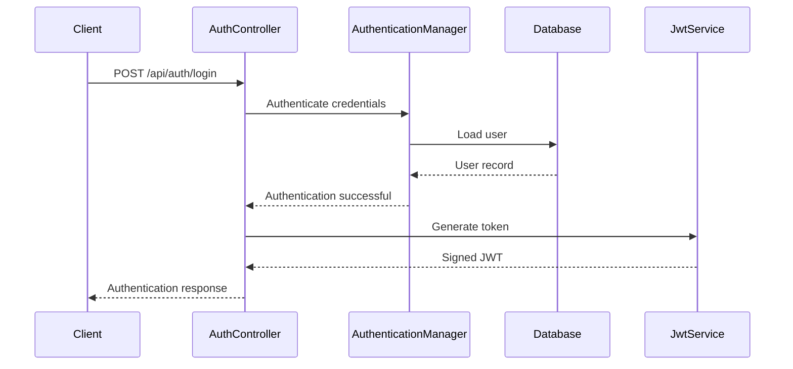
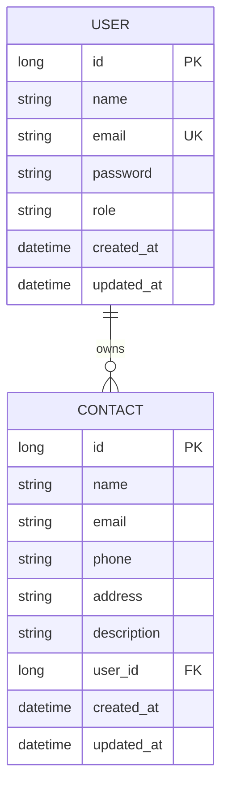
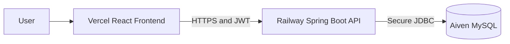

<div align="center">

# 💻 Contact Manager - Enterprise REST API

**Secure, scalable, and production-ready contact management backend built with Java and Spring Boot.**

[](https://www.java.com/)
[](https://spring.io/projects/spring-boot)
[](https://spring.io/projects/spring-security)
[](https://www.mysql.com/)
[](https://railway.app/)
[](https://junit.org/junit5/)
[](#license)

[Live Application](https://contact-manager-ui-alpha.vercel.app/contacts) |
[Backend API](https://contact-manager-api-production-0aa6.up.railway.app) |
[Frontend Repository](https://github.com/AkramSE/Contact-Manager-UI) |
[GitHub Profile](https://github.com/AkramSE)

</div>

---

## Overview

Contact Manager is a secure REST API for managing authenticated users and their personal contacts.

The application uses a layered architecture and includes JWT authentication, contact CRUD operations, search, pagination, validation, centralized exception handling, logging, testing, and cloud deployment.

## Features

### Authentication

- User registration and login
- JWT token generation and validation
- Stateless Spring Security configuration
- BCrypt password hashing
- Protected REST endpoints
- Custom authentication error handling
- CORS configuration

### Contact Management

- Create a contact
- Retrieve all contacts
- Retrieve a contact by ID
- Update a contact
- Delete a contact
- Search contacts
- Paginated results
- User-specific contact ownership

### Engineering

- Layered architecture
- DTO-based API contracts
- Jakarta Bean Validation
- Global exception handling
- SLF4J and Logback logging
- Unit testing with JUnit 5 and Mockito
- Environment-based configuration
- Cloud deployment

## Technology Stack

| Category | Technology |
|---|---|
| Language | Java 17 |
| Framework | Spring Boot 3.x |
| Security | Spring Security |
| Authentication | JSON Web Token |
| Password Hashing | BCrypt |
| Persistence | Spring Data JPA |
| ORM | Hibernate |
| Database | MySQL |
| Validation | Jakarta Bean Validation |
| Build Tool | Maven |
| Logging | SLF4J and Logback |
| Testing | JUnit 5 and Mockito |
| Backend Hosting | Railway |
| Database Hosting | Aiven |
| API Style | REST |
| Data Format | JSON |

## Architecture



### Layer Responsibilities

| Layer | Responsibility |
|---|---|
| Controller | Handles HTTP requests and responses |
| DTO | Defines request and response contracts |
| Service | Contains business logic |
| Repository | Performs database operations |
| Entity | Maps Java objects to database tables |
| Security | Authenticates users and protects endpoints |
| Exception | Handles application errors centrally |
| Configuration | Defines security, CORS, and application settings |

## JWT Authentication Flow



Protected requests must include the token in the authorization header:

```http
Authorization: Bearer <jwt-token>
```

## 📁 Project Structure

```text
src/main/java/com/tenpearls/contact_manager/
├── config/         # Security and application configurations
├── controller/     # RESTful endpoints handling HTTP requests
├── dto/            # Data Transfer Objects for payload isolation
├── entity/         # JPA Entities mapping to database tables
├── exception/      # Global exception handlers and custom exceptions
├── repository/     # Spring Data JPA interfaces
├── security/       # JWT filters, entry points, and providers
└── service/        # Core business logic implementation

## Database Design



A user can own multiple contacts, while each contact belongs to one user.

## API Endpoints

### Authentication

| Method | Endpoint | Access | Description |
|---|---|---|---|
| `POST` | `/api/auth/register` | Public | Register a new user |
| `POST` | `/api/auth/login` | Public | Authenticate a user and return a JWT |

### Contacts

| Method | Endpoint | Access | Description |
|---|---|---|---|
| `POST` | `/api/contacts` | Private | Create a contact |
| `GET` | `/api/contacts` | Private | Retrieve contacts |
| `GET` | `/api/contacts/{id}` | Private | Retrieve a contact by ID |
| `PUT` | `/api/contacts/{id}` | Private | Update a contact |
| `DELETE` | `/api/contacts/{id}` | Private | Delete a contact |
| `GET` | `/api/contacts/search` | Private | Search contacts |

### Pagination

```http
GET /api/contacts?page=0&size=10&sort=name,asc
```

### Search

```http
GET /api/contacts/search?keyword=akram
```

## Request Examples

### Register

```http
POST /api/auth/register
Content-Type: application/json

{
  "name": "Muhammad Akram",
  "email": "akram@example.com",
  "password": "StrongPassword123"
}
```

### Login

```http
POST /api/auth/login
Content-Type: application/json

{
  "email": "akram@example.com",
  "password": "StrongPassword123"
}
```

### Create Contact

```http
POST /api/contacts
Content-Type: application/json
Authorization: Bearer <jwt-token>

{
  "name": "Ali Khan",
  "email": "ali@example.com",
  "phone": "+92-300-1234567",
  "address": "Karachi, Pakistan",
  "description": "Professional contact"
}
```

## Validation

Example request validation:

```java
public class RegisterRequest {

    @NotBlank(message = "Name is required")
    private String name;

    @NotBlank(message = "Email is required")
    @Email(message = "Please provide a valid email address")
    private String email;

    @NotBlank(message = "Password is required")
    @Size(min = 8, message = "Password must contain at least 8 characters")
    private String password;
}
```

The API validates required fields, email format, password length, duplicate users, and invalid resource identifiers.

## Exception Handling

Centralized exception handling is implemented with `@RestControllerAdvice`.

Example error response:

```json
{
  "timestamp": "2026-08-02T10:40:00",
  "status": 404,
  "error": "Resource Not Found",
  "message": "Contact not found with ID: 25",
  "path": "/api/contacts/25"
}
```

### HTTP Status Codes

| Code | Meaning |
|---|---|
| `200 OK` | Request completed successfully |
| `201 Created` | Resource created successfully |
| `204 No Content` | Resource deleted successfully |
| `400 Bad Request` | Invalid input or validation failure |
| `401 Unauthorized` | Missing or invalid authentication |
| `403 Forbidden` | Access is not allowed |
| `404 Not Found` | Resource was not found |
| `409 Conflict` | Duplicate resource |
| `500 Internal Server Error` | Unexpected server error |

## Logging

The application uses SLF4J with Logback.

```java
private static final Logger log =
        LoggerFactory.getLogger(ContactServiceImpl.class);

log.info("Creating contact for user: {}", userEmail);
log.warn("Contact not found with ID: {}", contactId);
log.error("Unexpected error while creating contact", exception);
```

Passwords, database credentials, private keys, and complete JWT tokens must never be logged.

## Testing

Run tests with the Maven wrapper:

```bash
./mvnw test
```

Windows:

```bash
mvnw.cmd test
```

Main testing areas:

- Authentication logic
- Contact CRUD operations
- Repository interactions
- Validation failures
- Resource-not-found handling
- Duplicate-user handling
- Unauthorized access

## Local Setup

### Requirements

- Java 17 or later
- MySQL 8 or later
- Git
- Maven 3.8 or later, or the included Maven wrapper

### Clone Repository

```bash
git clone https://github.com/AkramSE/Contact-Manager-API.git
cd Contact-Manager-API
```

### Create Database

```sql
CREATE DATABASE contact_manager_db;
```
## 🔒 Security Best Practices

> **Important:** Passwords, database credentials, private keys, and complete JWT tokens are never logged.

Always use environment variables for sensitive data. Never commit secrets to version control.
Configure your `application.properties` (or `application-prod.yml`) using the following structure:

```properties
spring.datasource.url=${DB_URL}
spring.datasource.username=${DB_USERNAME}
spring.datasource.password=${DB_PASSWORD}
jwt.secret=${JWT_SECRET}
jwt.expiration=${JWT_EXPIRATION}


### Application Configuration

```properties
spring.application.name=contact-manager

server.port=${PORT:8080}

spring.datasource.url=${DB_URL}
spring.datasource.username=${DB_USERNAME}
spring.datasource.password=${DB_PASSWORD}
spring.datasource.driver-class-name=com.mysql.cj.jdbc.Driver

spring.jpa.hibernate.ddl-auto=update
spring.jpa.show-sql=false

jwt.secret=${JWT_SECRET}
jwt.expiration=${JWT_EXPIRATION:86400000}

frontend.url=${FRONTEND_URL:http://localhost:5173}

logging.level.root=INFO
```

### Run Application

Linux and macOS:

```bash
./mvnw clean spring-boot:run
```

Windows:

```bash
mvnw.cmd clean spring-boot:run
```

Local API base URL:

```text
http://localhost:8080
```

## Deployment



| Service | Platform | URL |
|---|---|---|
| Frontend | Vercel | [Open Application](https://contact-manager-ui-alpha.vercel.app/contacts) |
| Backend | Railway | [Open Backend API](https://contact-manager-api-production-0aa6.up.railway.app) |
| Database | Aiven | Private production database |

Recommended production variables:

```env
DB_URL=jdbc:mysql://your-aiven-host:your-port/defaultdb?ssl-mode=REQUIRED
DB_USERNAME=your_aiven_username
DB_PASSWORD=your_aiven_password
JWT_SECRET=your_production_jwt_secret
JWT_EXPIRATION=86400000
FRONTEND_URL=https://contact-manager-ui-alpha.vercel.app
PORT=8080
```

Never commit secrets or production credentials.

```gitignore
.env
application-local.properties
application-secret.properties
```

## Contributing

```bash
git checkout -b feature/your-feature-name
git commit -m "feat: add your feature"
git push origin feature/your-feature-name
```

Open a pull request with a clear description of the changes.

## License

This project is licensed under the MIT License.

## 👨‍💻 Author

**Muhammad Akram**  
*Software Engineering Student & Full-Stack Java Developer*

- 💼 **LinkedIn:** [linkedin.com/in/muhammad-akram-se](https://linkedin.com/in/muhammad-akram-se)
- 🐙 **GitHub:** [github.com/AkramSE](https://github.com/AkramSE)
- 🖥️ **Frontend Repository:** [Contact-Manager-UI](https://github.com/AkramSE/Contact-Manager-UI)
- ⚙️ **Backend Repository:** [Contact-Manager-API](https://github.com/AkramSE/Contact-Manager-API)

---
*If you like this project, please consider giving it a ⭐ on GitHub!* 
