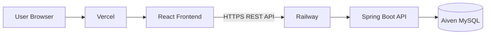
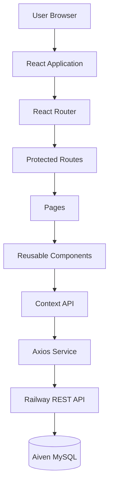
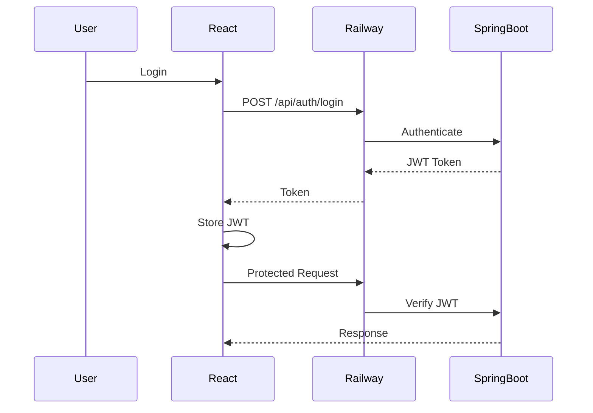
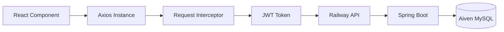
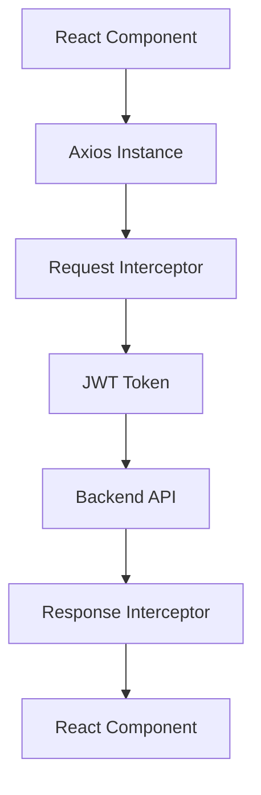
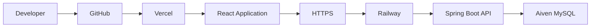
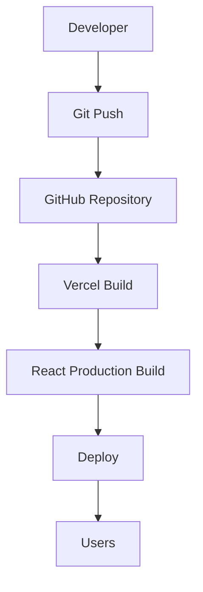
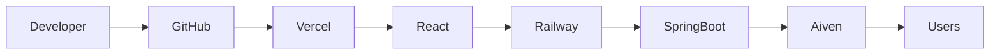

<div align="center">

# 💻 Contact Manager — Enterprise React Frontend

### Modern, Secure, Scalable & Production-Ready React Application

<p align="center">


</p>

<br>

A production-ready frontend application built using **React 18**, **Bootstrap 5**, **Axios**, **React Router DOM**, and **JWT Authentication**.

The application follows modern frontend engineering principles including reusable components, protected routing, centralized API communication, responsive UI, cloud deployment, and enterprise-level architecture.

Designed to work seamlessly with the **Spring Boot Contact Manager REST API**.

<br>

### 🌐 Live Production

| Service | Platform | Status |
|----------|----------|--------|
| Frontend | Vercel | 🟢 Live |
| Backend | Railway | 🟢 Live |
| Database | Aiven MySQL | 🟢 Live |

### 🚀 Live URLs

**Frontend**

https://contact-manager-ui-alpha.vercel.app/contacts

**Backend API**

https://contact-manager-api-production-0aa6.up.railway.app

**Frontend Repository**

https://github.com/AkramSE/Contact-Manager-UI

**Backend Repository**

https://github.com/AkramSE/Contact-Manager-API

</div>

---

# 📑 Table of Contents

- Overview
- Live Deployment
- Cloud Infrastructure
- Features
- Technology Stack
- Frontend Architecture
- Authentication Flow
- API Communication
- Folder Structure
- Routing
- State Management
- Axios Configuration
- Environment Variables
- Local Development
- Production Deployment
- Performance Optimizations
- Security
- Responsive Design
- Build Process
- Future Roadmap
- Contributing
- License
- Author

---

# 📌 Overview

Contact Manager Enterprise Frontend is a secure React application developed following enterprise software architecture.

The application communicates with a Spring Boot backend using REST APIs secured with JWT Authentication.

It provides an intuitive user interface for authenticated users to manage contacts efficiently while maintaining scalability, maintainability, and security.

---

# 🚀 Live Deployment

| Platform | Purpose |
|-----------|----------|
| **Vercel** | Frontend Hosting |
| **Railway** | Spring Boot Backend |
| **Aiven Cloud** | Production MySQL Database |
| **GitHub** | Version Control |
| **JWT** | Authentication |
| **HTTPS** | Secure Communication |

---

# ☁️ Cloud Infrastructure



---

# ✨ Enterprise Features

## 🔐 Authentication

- JWT Authentication
- Secure Login
- Secure Registration
- Protected Routes
- Auto Login
- Auto Logout
- Token Validation
- Secure Local Storage

---

## 📇 Contact Management

- Create Contact
- Update Contact
- Delete Contact
- Search Contact
- Pagination
- CSV Export
- CSV Import
- User Dashboard

---

## 🎨 User Experience

- Bootstrap 5
- Glassmorphism UI
- Responsive Design
- SweetAlert2
- Loading Spinners
- Error Pages
- Empty States
- Mobile Friendly

---

## ⚡ Engineering Features

- Axios Interceptors
- Protected Routing
- Component Reusability
- API Service Layer
- Environment Configuration
- React Hooks
- Context API
- Optimized Rendering
- Modular Folder Structure
- Production Build Ready


---

# 🛠 Technology Stack

| Category | Technology |
|-----------|------------|
| Language | JavaScript (ES6+) |
| Framework | React 18 |
| UI Framework | Bootstrap 5 |
| Styling | CSS3 + Glassmorphism |
| Routing | React Router DOM v6 |
| HTTP Client | Axios |
| Authentication | JWT |
| State Management | React Hooks + Context API |
| Icons | React Icons |
| Notifications | SweetAlert2 |
| Deployment | Vercel |
| Backend | Spring Boot REST API |
| Database | MySQL (Aiven Cloud) |

---

# 🏗 Enterprise Frontend Architecture



---

## 📖 Architecture Layers

| Layer | Responsibility |
|---------|----------------|
| UI Layer | User Interface |
| Routing Layer | Navigation |
| Authentication Layer | JWT Validation |
| State Layer | Global State |
| Service Layer | REST API Communication |
| Backend Layer | Spring Boot API |
| Database Layer | MySQL |

---

# 📂 Project Structure

```text
Contact-Manager-UI/

├── public/
│
├── src/
│   ├── assets/
│   │   ├── images/
│   │   ├── icons/
│   │   └── styles/
│   │
│   ├── components/
│   │   ├── Navbar/
│   │   ├── Footer/
│   │   ├── ContactCard/
│   │   ├── ContactForm/
│   │   ├── Loader/
│   │   ├── SearchBar/
│   │   ├── Pagination/
│   │   └── Modal/
│   │
│   ├── pages/
│   │   ├── Login/
│   │   ├── Register/
│   │   ├── Dashboard/
│   │   ├── Contacts/
│   │   ├── AddContact/
│   │   ├── EditContact/
│   │   └── NotFound/
│   │
│   ├── context/
│   │   ├── AuthContext.js
│   │   └── ContactContext.js
│   │
│   ├── hooks/
│   │   ├── useAuth.js
│   │   └── useContacts.js
│   │
│   ├── routes/
│   │   ├── PrivateRoute.js
│   │   └── PublicRoute.js
│   │
│   ├── services/
│   │   ├── api.js
│   │   ├── authService.js
│   │   └── contactService.js
│   │
│   ├── utils/
│   │   ├── constants.js
│   │   ├── validators.js
│   │   └── helpers.js
│   │
│   ├── App.js
│   └── index.js
│
├── .env
├── package.json
├── README.md
└── vercel.json
```

---

# 📌 Folder Responsibilities

| Folder | Purpose |
|----------|---------|
| assets | Images, Fonts, CSS |
| components | Reusable UI Components |
| pages | Application Screens |
| routes | Route Protection |
| context | Global State |
| hooks | Custom Hooks |
| services | Axios API Layer |
| utils | Utility Functions |

---

# 🔐 JWT Authentication Flow



---

# 🌐 API Communication



---

# 🔄 Axios Request Lifecycle



---

## ⚙ Axios Instance

```javascript
import axios from "axios";

const api = axios.create({

    baseURL: process.env.REACT_APP_API_BASE_URL,

    headers: {

        "Content-Type": "application/json"

    }

});

export default api;
```

---

## 🔐 Request Interceptor

```javascript
api.interceptors.request.use(

(config)=>{

const token = localStorage.getItem("jwtToken");

if(token){

config.headers.Authorization=`Bearer ${token}`;

}

return config;

}

);
```

---

## ❌ Response Interceptor

```javascript
api.interceptors.response.use(

(response)=>response,

(error)=>{

if(error.response?.status===401){

localStorage.clear();

window.location="/login";

}

return Promise.reject(error);

}

);
```

---

# 🔒 Protected Routing

```text
Guest User
      │
      ▼

Login Page

      │

JWT Generated

      │

Protected Route

      │

Dashboard

      │

Contacts

      │

Logout
```

---

# 🌍 API Integration

| Service | Endpoint |
|----------|----------|
| Login | POST /api/auth/login |
| Register | POST /api/auth/register |
| Contacts | GET /api/contacts |
| Add Contact | POST /api/contacts |
| Update Contact | PUT /api/contacts/{id} |
| Delete Contact | DELETE /api/contacts/{id} |
| Search | GET /api/contacts/search | 


---

# 💻 Local Development

## 📋 Prerequisites

Before running the project locally, ensure the following software is installed:

| Software | Version |
|-----------|----------|
| Node.js | 18+ |
| npm | 9+ |
| Git | Latest |
| VS Code | Recommended |
| Google Chrome | Latest |

---

## 📥 Clone Repository

```bash
git clone https://github.com/AkramSE/Contact-Manager-UI.git

cd Contact-Manager-UI
```

---

## 📦 Install Dependencies

```bash
npm install
```

or

```bash
npm i
```

---

# 🔧 Environment Variables

Create a **.env** file in the root directory.

```env
REACT_APP_API_BASE_URL=http://localhost:8080
```

For Production

```env
REACT_APP_API_BASE_URL=https://contact-manager-api-production-0aa6.up.railway.app
```

---

## 📄 Example

```text
Contact-Manager-UI/

│── src/

│── public/

│── .env

│── package.json

│── README.md
```

---

# ▶ Run Application

Development Mode

```bash
npm start
```

Production Build

```bash
npm run build
```

Run Tests

```bash
npm test
```

---

## 🌐 Local URL

```text
http://localhost:3000
```

---

# ☁ Production Cloud Deployment

The application is fully deployed on cloud infrastructure.

| Service | Platform | Status |
|-----------|-----------|---------|
| Frontend | Vercel | 🟢 Live |
| Backend | Railway | 🟢 Live |
| Database | Aiven MySQL | 🟢 Live |

---

## 🌍 Production URLs

### Frontend

```text
https://contact-manager-ui-alpha.vercel.app/contacts
```

### Backend

```text
https://contact-manager-api-production-0aa6.up.railway.app
```

---

# ☁ Cloud Deployment Architecture



---

# 🚀 Deployment Workflow



---

# ⚙ Vercel Deployment

Every push to the **main** branch automatically triggers:

- Install Dependencies
- Build React Project
- Optimize Assets
- Deploy Latest Version
- Global CDN Distribution

---

## Example Vercel Environment Variable

```env
REACT_APP_API_BASE_URL=https://contact-manager-api-production-0aa6.up.railway.app
```

---

# 🔐 Security

The frontend follows modern security practices.

## Authentication

- JWT Authentication
- Protected Routes
- Secure Login
- Secure Registration
- Automatic Logout
- Unauthorized Route Protection

---

## Token Security

- Authorization Header
- Bearer Token
- Request Validation
- Automatic Token Injection
- Secure Route Access

Example

```http
Authorization: Bearer <jwt-token>
```

---

## Client-side Protection

- Route Guards
- Context Authentication
- Session Validation
- Unauthorized Redirects
- Error Handling

---

# 🌐 API Communication

Every API request passes through the centralized Axios instance.

```text
React Component

↓

Axios Instance

↓

Request Interceptor

↓

JWT Token

↓

Spring Boot REST API

↓

JSON Response

↓

React Component
```

---

# ⚡ Performance Optimizations

The application is optimized for production deployment.

## Performance Features

- Lazy Loading Ready
- Component Reusability
- Optimized API Requests
- Centralized Axios Instance
- Reduced Re-rendering
- Modular Codebase
- Production Build Optimization
- Fast Routing
- Efficient State Updates

---

# 📱 Responsive Design

Fully responsive across all devices.

Supported Devices

- Desktop
- Laptop
- Tablet
- Mobile
- Large Screens

Responsive Components

- Navbar
- Dashboard
- Login
- Register
- Contacts
- Forms
- Tables
- Pagination
- Search

---

# 🎨 UI Components

Main reusable components include:

- Navbar
- Footer
- Contact Card
- Contact Form
- Search Bar
- Pagination
- Loader
- Protected Route
- Alert Dialog
- Modal

---

# 📦 Build Process

Development

```bash
npm start
```

Production

```bash
npm run build
```

Preview Build

```bash
npx serve -s build
```

---

# 📁 Build Output

```text
build/

├── static/

├── assets/

├── index.html

└── favicon.ico
```

---

# 🧹 Code Quality

The project follows clean coding practices.

- Modular Components
- Reusable Functions
- Separation of Concerns
- Consistent Folder Structure
- Scalable Architecture
- Easy Maintenance
- Production Ready Code

---

# 🚀 Advanced Features

The application is designed using modern frontend engineering principles and enterprise development standards.

---

## 🔐 Authentication Module

### User Registration

- Create new account
- Client-side validation
- Duplicate email protection
- Password validation
- Automatic login support

---

### User Login

- JWT Authentication
- Secure Login
- Remember Session
- Protected Dashboard
- Error Handling

---

### Session Management

- JWT Storage
- Automatic Authentication
- Route Protection
- Token Validation
- Automatic Logout

---

# 📇 Contact Management

Users can manage contacts through an intuitive dashboard.

## Available Operations

- Create Contact
- View Contact
- Edit Contact
- Delete Contact
- Search Contacts
- Pagination
- CSV Import
- CSV Export

---

## Dashboard Features

- Total Contacts
- Search Contacts
- Pagination
- Quick Actions
- Responsive Table
- Loading Indicators
- Success Alerts
- Error Alerts

---

# 🔍 Search Functionality

Supports real-time searching.

Features include:

- Name Search
- Email Search
- Phone Search
- Instant Results
- Backend Integration

---

# 📄 Pagination

Efficient pagination for large datasets.

Features

- Previous Page
- Next Page
- Current Page
- Page Numbers
- Dynamic Page Size

---

# 📂 CSV Operations

## Export

- Export Contacts
- Download CSV
- Preserves Data Structure

## Import

- Upload CSV
- File Validation
- Error Detection
- Import Preview

---

# 🎨 User Interface

Designed with a modern Glassmorphism theme.

## UI Highlights

- Glass Cards
- Modern Navbar
- Responsive Layout
- Beautiful Forms
- Interactive Buttons
- Smooth Hover Effects
- Rounded Components
- Professional Typography

---

# 📱 Responsive Design

Optimized for:

- Desktop
- Laptop
- Tablet
- Mobile

Supports all modern browsers.

- Chrome
- Edge
- Firefox
- Safari

---

# 📸 Application Screenshots

### Login


### Register


### Dashboard


---

---

# ⚙ Environment Configuration

Example

```env
REACT_APP_API_BASE_URL=https://contact-manager-api-production-0aa6.up.railway.app
```

Never commit:

```text
.env
API Keys
JWT Secrets
Private URLs
Credentials
```

---

# 🤝 Contributing

Contributions are welcome.

## Workflow

```bash
git clone https://github.com/AkramSE/Contact-Manager-UI.git

git checkout -b feature/your-feature

git commit -m "feat: add new feature"

git push origin feature/your-feature
```

Open a Pull Request with a clear description of your changes.

---

# 📄 License

This project is licensed under the **MIT License**.

```text
MIT License

Copyright (c) 2026 Muhammad Akram

Permission is hereby granted, free of charge,
to any person obtaining a copy
of this software and associated documentation files
to deal in the Software without restriction.
```

---

# 🙏 Acknowledgements

Special thanks to the open-source community and the teams behind:

- React
- Bootstrap
- Axios
- React Router
- SweetAlert2
- Vercel
- Railway
- Aiven
- Spring Boot

---

# ⭐ Support

If you found this project helpful:

⭐ Star this repository

🍴 Fork the repository

🛠 Contribute new features

🐞 Report issues

💡 Share suggestions 


---

# 👨‍💻 Author

<div align="center">

# Muhammad Akram

### Software Engineering Student • Java Backend Developer • React Frontend Developer

Passionate about building secure, scalable, and production-ready full-stack applications using modern technologies and enterprise software engineering principles.

</div>

---

# 🔗 Project Links

## 🌐 Live Application

```text
https://contact-manager-ui-alpha.vercel.app/contacts
```

---

## ⚙ Backend API

```text
https://contact-manager-api-production-0aa6.up.railway.app
```

---

## 💻 Frontend Repository

```text
https://github.com/AkramSE/Contact-Manager-UI
```

---

## 🚀 Backend Repository

```text
https://github.com/AkramSE/Contact-Manager-API
```

---

## 👤 GitHub Profile

```text
https://github.com/AkramSE
```

---

# 📊 Project Summary

| Category | Details |
|----------|----------|
| Project Type | Enterprise React Frontend |
| Framework | React 18 |
| Backend | Spring Boot REST API |
| Database | MySQL (Aiven Cloud) |
| Authentication | JWT |
| HTTP Client | Axios |
| Routing | React Router DOM |
| UI Framework | Bootstrap 5 |
| Deployment | Vercel |
| Backend Hosting | Railway |
| Architecture | Component-Based |
| API Style | REST |
| Environment | Production Ready |

---

# 🏆 Key Highlights

- Enterprise-Level Architecture
- Production-Ready Deployment
- Secure JWT Authentication
- Protected Routes
- Axios Interceptors
- Responsive UI
- REST API Integration
- Reusable Components
- Context API State Management
- Bootstrap 5 UI
- Cloud Deployment
- Clean Folder Structure
- Easy Maintenance
- Scalable Codebase
- Professional Documentation

---

# 📈 Development Workflow



---

# 🎯 Project Goals

The primary objective of this project is to demonstrate enterprise frontend development practices by integrating React with a secure Spring Boot REST API.

This project showcases:

- Secure Authentication
- Modern UI Design
- RESTful API Consumption
- Cloud Deployment
- Component Reusability
- Responsive Design
- Production-Ready Configuration
- Scalable Frontend Architecture

---

# 📚 Learning Outcomes

This project demonstrates practical experience with:

- React 18
- Bootstrap 5
- React Router DOM
- Axios
- Context API
- JWT Authentication
- REST API Integration
- Responsive Web Design
- Cloud Deployment
- Git & GitHub
- Software Engineering Best Practices

---

# ⭐ Repository Support

If you found this project useful, consider supporting it by:

```text
⭐ Star this repository

🍴 Fork the repository

🐛 Report issues

💡 Suggest improvements

🤝 Contribute new features
```

---

# 📜 License

Licensed under the MIT License.

See the LICENSE file for complete details.

---

<div align="center">

# 🚀 Contact Manager — Enterprise React Frontend

### Secure • Scalable • Responsive • Production Ready

Built with ❤️ using

**React 18 • Bootstrap 5 • Axios • JWT • React Router DOM • Vercel • Railway • Aiven MySQL**

---

### Cloud Infrastructure

```
User
   │
   ▼
Vercel
   │
   ▼
React Frontend
   │ HTTPS + JWT
   ▼
Railway
   │
   ▼
Spring Boot REST API
   │
   ▼
Aiven MySQL
```

---

### Production Stack

Frontend → **Vercel**

Backend → **Railway**

Database → **Aiven Cloud MySQL**

Authentication → **JWT**

Communication → **REST API**

Deployment → **Cloud Native**

---

**Made with ❤️ by Muhammad Akram**

⭐ If you like this project, don't forget to Star the repository.

</div> 
